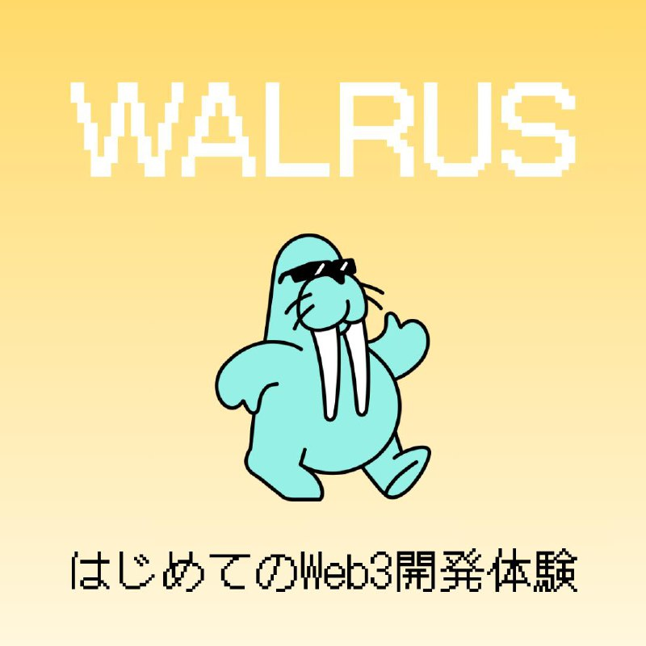

<!-- _paginate: false -->
<!-- _class: lead -->

# Sui × Walrusでつくる
## 改ざん不可能なWebサイト
### はじめてのWeb3開発体験

---

## アジェンダ

1. Suiとは  
2. Walrusとは  
3. なぜ必要なのか（事件例）  
4. Walrusの特徴  
5. Walrus Site紹介  
6. ユースケース  
7. 実際にサイトを作ってみよう！

---

## Suiとは

- **高速・スケーラブルなL1ブロックチェーン**
- **並列処理で高TPS**
- **オブジェクト指向のデータ構造**
- **Move言語による安全性**
- **低ガス・高速確定性**

---

<!-- _class: quiz -->
## 🎯 クイズ1：Suiの性能

# Q. Suiは1秒間に何件の
# トランザクションを処理できる？

1. 約2万4000件
2. 約6万5000件
3. 約30万件

---

<!-- _class: quiz -->
## 🎯 クイズ1：答え

# Q. Suiは1秒間に何件の
# トランザクションを処理できる？

1. 約2万4000件（Visaの処理能力）  
2. 約6万5000件（Solanaの理論値）  
3. **約30万件（テスト環境で29万7000 TPS達成）** ✅

---

## Walrusとは

- **Sui上の分散型データストレージ**
- **誰が・いつ・何を保存したかを証明**
- **改ざん不可能・検証可能**
- **保存をスマートコントラクト条件に利用**
- **信頼を設計で保証**

---

<!-- _class: quiz -->
## 🎯 クイズ2：ファイルの真正性

# Q. インターネットにアップしたファイルは
# 誰にも改ざんされない。○か×か？

---

<!-- _class: quiz -->
## 🎯 クイズ2：答え

# Q. インターネットにアップしたファイルは
# 誰にも改ざんされない。○か×か？

### 答え：❌ 
#### クラウド上のファイルは管理者や侵入者が書き換え可能

---

## なぜWalrusが必要か

- **クラウドは「正しく運用しているはず」に依存**
- **改ざん事例：**
  - Bybit事件（AWS上のJS書き換え）
  - Radiant Capital事件（PDF経由で改ざん）
- **保存＝正しいの保証はない**
- **重要データは構造的な真正性保証が必須**

---

<!-- _class: quiz -->
## 🎯 クイズ3：Bybit事件

# Q. Bybit事件で使われた攻撃はどれ？

1. ゼロデイ攻撃  
2. サーバー改ざん  
3. フィッシング

---

<!-- _class: quiz -->
## 🎯 クイズ3：答え

# Q. Bybit事件で使われた攻撃はどれ？

1. ゼロデイ攻撃  
2. **サーバー改ざん** ✅  
3. フィッシング

#### AWS上のJavaScriptが書き換えられた

---

## Walrusの特徴

- **保存証明（Blob ID＋署名＋時刻）**
- **二次元エンコード「Red Stuff」で高耐障害性**
- **Suiとネイティブ統合**
- **真正性＋プログラマビリティ**

---

## Walrus Siteとは

- **静的WebサイトをWalrus上にホスティング**
- **保存証明付きで配信**
- **SuiNS（.suiドメイン）対応**
- **改ざん検知（SRI対応）**
- **CLIやGitHub Actionsでデプロイ**

---

## Walrus Siteのメリット

- **改ざん耐性のあるフロントエンド配信**
- **文書・証明書の真正性保証付き公開**
- **NFT・トークン連動サイト**
- **AIモデルやデータDAOポータル**
- **「安さ」より「構造的信頼」**

---

## ユースケース例

1. **改ざん不可能な契約書配布**  
2. **信頼できるdAppフロントエンド**  
3. **AIモデル・学習データの配布**  
4. **永続保存と連動するNFT**  
5. **データDAOによる公共アーカイブ**

---

## まとめ

- **クラウドは便利だが真正性保証はない**
- **Walrusは保存そのものを証明可能**
- **Walrus Siteで改ざん耐性Webを構築**
- **「信頼を人に委ねない」新しいデータ保存モデル**

---
